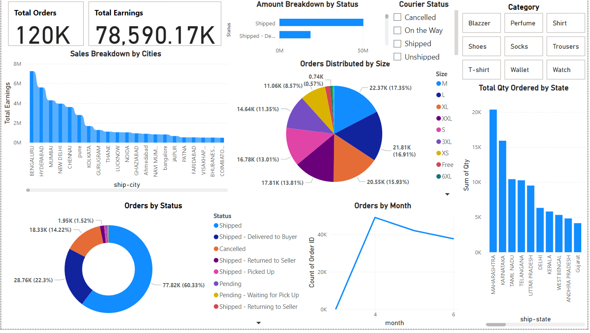
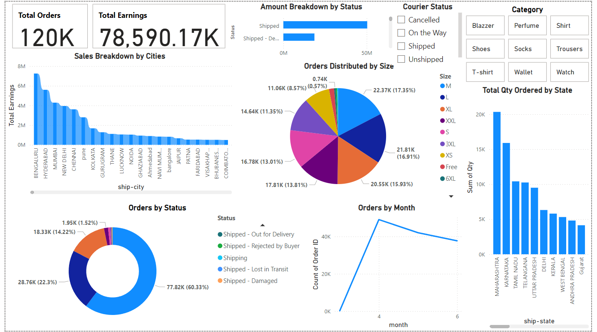
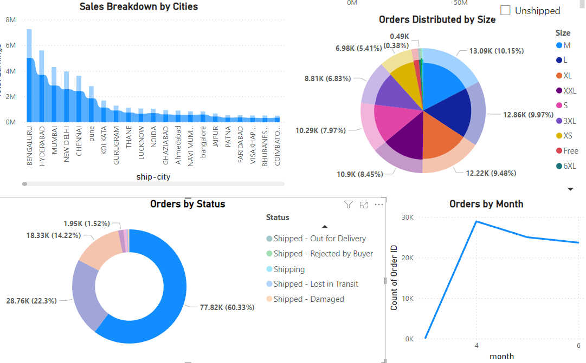

1.Total Orders by Status
Shows the breakdown of orders across different statuses, such as Delivered, Canceled, and Pending, helping to understand fulfillment performance.

2.Revenue by City
Displays total earnings by city, giving insight into geographic areas with the highest sales.

3.Sales Trends Over Time
Visualizes order volume over time, identifying peak sales periods and seasonal patterns.

4.Top Products by Category
Highlights the most popular product categories, showcasing customer preferences.

5.Most Ordered Sizes
Shows the distribution of orders by product size, useful for inventory planning and understanding customer preferences.

## Dashboard Preview

